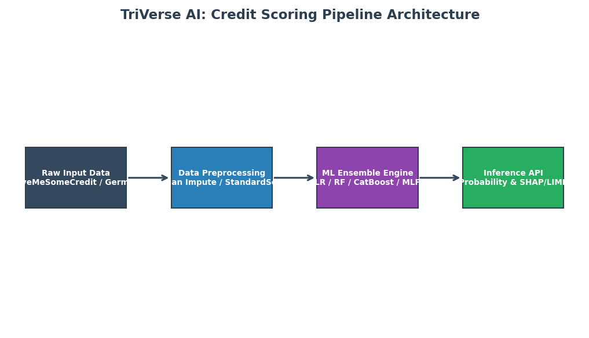
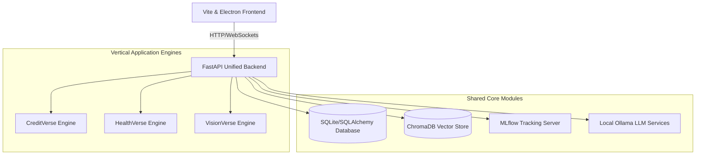

# TriVerse AI
### Enterprise AI Benchmarking & Experiment Management Platform

TriVerse AI is an enterprise-grade, modular monorepo platform designed for local-first Machine Learning operations, benchmarking, and experiment tracking. It serves as the master platform powering three high-impact AI/ML projects submitted for CodeAlpha evaluation.

---

## Architecture Overview
The platform uses a unified multi-app design linked via shared libraries, a central FastAPI backend, and an interactive Vite-based dashboard. 

---

## CodeAlpha Tasks Mappings & Hierarchy

| Task Folder | Source Code | Jupyter EDA | Unit Tests | Requirements |
| :--- | :--- | :--- | :--- | :--- |
| **[Task 1: Credit Scoring](./CodeAlpha_Task1_CreditScoring/)** | [src/](./CodeAlpha_Task1_CreditScoring/src/) | [notebooks/](./CodeAlpha_Task1_CreditScoring/notebooks/) | [tests/](./CodeAlpha_Task1_CreditScoring/tests/) | [requirements.txt](./CodeAlpha_Task1_CreditScoring/requirements.txt) |
| **[Task 4: Disease Detection](./CodeAlpha_Task4_Disease%20Detuction/)** | [src/](./CodeAlpha_Task4_Disease%20Detuction/src/) | [notebooks/](./CodeAlpha_Task4_Disease%20Detuction/notebooks/) | [tests/](./CodeAlpha_Task4_Disease%20Detuction/tests/) | [requirements.txt](./CodeAlpha_Task4_Disease%20Detuction/requirements.txt) |
| **[Task 3: Handwritten Recognition](./CodeAlpha_Task3_HandwrittenRecognition/)** | [src/](./CodeAlpha_Task3_HandwrittenRecognition/src/) | [notebooks/](./CodeAlpha_Task3_HandwrittenRecognition/notebooks/) | [tests/](./CodeAlpha_Task3_HandwrittenRecognition/tests/) | [requirements.txt](./CodeAlpha_Task3_HandwrittenRecognition/requirements.txt) |

---

## Technology Stack
- **Frontend**: Next.js/Vite, TypeScript, TailwindCSS, Chart.js, HTML5 Canvas API, Electron desktop integration.
- **Backend**: FastAPI, SQLAlchemy (Async), Uvicorn, Python 3.11.
- **ML Frameworks**: PyTorch, Scikit-Learn, CatBoost, XGBoost, Optuna.
- **MLOps & Explainability**: MLflow (local tracking), SHAP, LIME.
- **Vector DB & LLM**: ChromaDB, Ollama (Qwen2.5/Llama3).

---

## Core Features & Engines

### 1. Dashboards
A beautiful, responsive glassmorphism control panel with live metrics, system utilization, dataset quality scoring, and training progression charts.

### 2. MLflow Tracking
Seamlessly logs every hyperparameter tuning trial, model training run, learning curves, and model weights to a local MLflow Tracking Server.

### 3. Optuna Hyperparameter Optimization
Enables automated Bayesian optimization directly from the UI. Run Optuna engines to search optimal learning rates, tree depths, and neural layer configurations.

### 4. Explainable AI (SHAP & LIME)
Demystifies model predictions by generating SHAP force plots and LIME feature attribution charts directly in the web browser. 

### 5. AI Assistant & Digital Twin
An interactive chat assistant powered by Ollama and RAG (Retrieval-Augmented Generation) over project documents. The Digital Twin simulates data drift and stress-tests models against anomaly scenarios.

---

## Datasets & Models

| Task / Module | Datasets | Models | Key Metrics |
| :--- | :--- | :--- | :--- |
| **Credit Scoring** (Task 1) | Kaggle Give Me Some Credit, Statlog German Credit | Logistic Regression, Decision Tree, Random Forest, CatBoost, MLP | ROC-AUC: ~0.865 (CatBoost) |
| **Disease Prediction** (Task 4) | UCI Heart Disease, Breast Cancer, Pima Diabetes | Logistic Regression, SVM, Random Forest, XGBoost, CatBoost, MLP | ROC-AUC: ~0.992 (XGBoost) |
| **Handwritten Recognition** (Task 3) | MNIST Digits, EMNIST Characters | Custom CNN, ResNet18 (PyTorch) | Accuracy: ~99.4% (ResNet18) |

---

## Screenshots
Screenshots for each CodeAlpha task are documented in their respective subdirectories:
- `01_home.png` - Home Dashboard overview
- `02_dataset.png` - Dataset details and correlation matrix
- `03_training.png` - Real-time training monitoring logs
- `04_results.png` - Benchmark leaderboards
- `05_comparison.png` - Multi-model comparison ROC/PR curves
- `06_prediction.png` - Interactive live predictions and explainability interfaces

---

## Installation & Setup

### Prerequisites
- Windows OS (Runs on Nvidia RTX GPUs for optimized DL training)
- **Miniconda** / **Anaconda** (Conda environment: `dgpu-core` with Python 3.11)
- **Node.js** 18+
- **Ollama** (running locally with `ollama pull qwen2.5:7b` or similar)

### Startup Instructions
Simply run the platform using the automated startup scripts:

1. **Double-click** `start.bat` (launches standard terminal logs for MLflow, FastAPI, and Next.js frontend).
2. Or use `launcher.vbs` (runs backend services silently and automatically launches the app wrapper).

Access endpoints:
- **Frontend Dashboard**: `http://localhost:3000`
- **FastAPI API Docs**: `http://localhost:8000/docs`
- **MLflow Tracker UI**: `http://localhost:5000`

---
*Developed under CodeAlpha Guidelines | Powered by TriVerse AI.*
